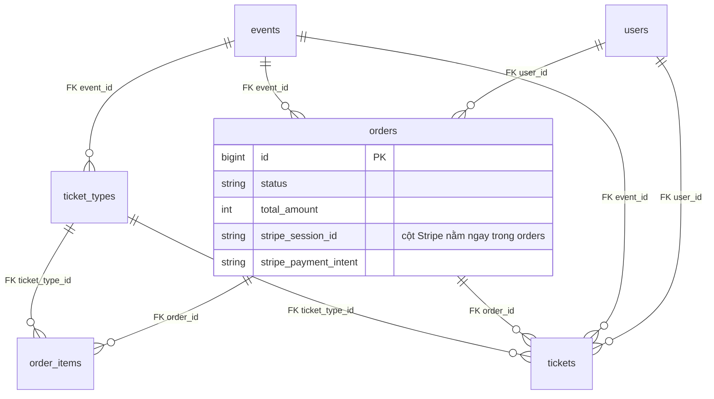
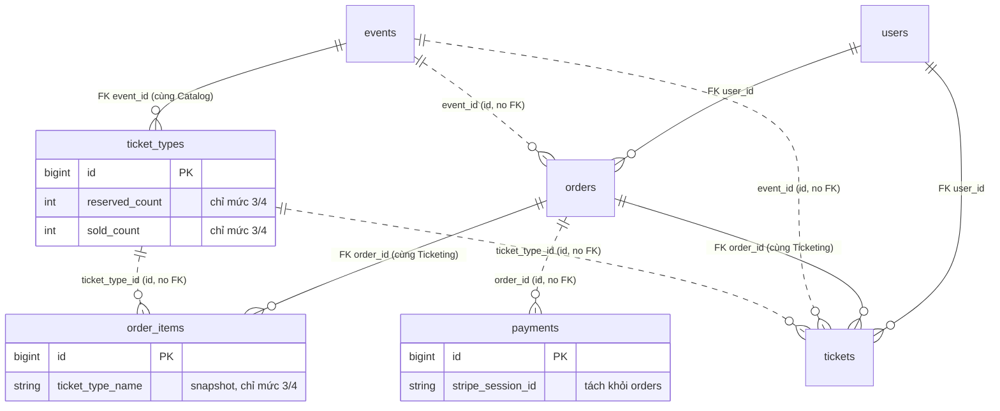

# Thiết kế Database qua bốn mức kiến trúc

| | |
| --- | --- |
| **Mã tài liệu** | ARCH-MONO-01-DB |
| **Phiên bản** | 1.0 |
| **Ngày ban hành** | 2026-07-12 |
| **Phạm vi áp dụng** | Bốn ứng dụng mẫu `level1`–`level4` (domain: bán vé sự kiện) |
| **Tài liệu gốc** | [README.md](../README.md) — quy chuẩn kiến trúc ARCH-MONO-01 |

---

## 1. Mục đích

Tài liệu này mô tả thiết kế database dùng chung cho bài toán bán vé sự kiện, và
**database thay đổi thế nào khi cùng một domain được cài đặt ở bốn mức kiến
trúc** khác nhau. Mỗi khác biệt về schema đều truy vết được về một quy định có
mã số trong README (ví dụ *QĐ-3.7*), thay vì thiết kế theo khẩu vị.

Kết luận cần nhớ trước: **schema logic gần như không đổi qua bốn mức — cùng
những thực thể đó, cùng những cột đó.** Cái thay đổi là:

1. **Migration nằm ở đâu** (một thư mục chung ↔ tách theo module).
2. **Ranh giới dữ liệu** — bảng nào được JOIN/khai báo foreign key sang bảng
   nào (mức 3+ cấm chéo module).
3. **Code map với bảng ra sao** (Eloquent = bảng ở mức 1–3 ↔ Entity + Mapper
   tách khỏi bảng ở mức 4).

Vì mục 3 là chuyện code, **schema vật lý của mức 3 và mức 4 là giống hệt nhau**
(đã kiểm chứng: các migration của `level3` và `level4` trùng khớp từng dòng).

## 2. Domain — bán vé sự kiện

Nghiệp vụ tối giản để làm ví dụ xuyên suốt bốn mức:

- Một **event** (sự kiện) có nhiều **ticket type** (hạng vé), mỗi hạng có giá và
  số lượng phát hành.
- Người dùng đặt một **order** (đơn hàng) gồm nhiều **order item** (dòng đơn,
  mỗi dòng một hạng vé × số lượng). Đơn được **giữ chỗ 15 phút** rồi hết hạn.
- Thanh toán qua Stripe. Đơn `paid` sẽ phát sinh các **ticket** (vé) có token QR
  duy nhất, dùng để soát vé tại cửa.

Sáu thực thể nghiệp vụ: `events`, `ticket_types`, `orders`, `order_items`,
`tickets`, và (từ mức 3) `payments`. Ngoài ra `users` là hạ tầng
authentication, luôn nằm ở `app/` mọi mức (QĐ-3.9).

## 3. Schema đầy đủ (mức 3/4 làm chuẩn)

Lấy bản mức 3/4 làm mốc vì nó tách bạch nhất; các mục sau chỉ ra mức 1/2 lược
bớt gì so với bản này.

### 3.1. `users` — hạ tầng, ở `app/`

| Cột | Kiểu | Ghi chú |
| --- | --- | --- |
| `id` | bigint PK | |
| `name`, `email`, `password` | | mặc định Laravel |
| `role` | string, default `user` | `user` = người mua; `scanner` = nhân viên soát vé |

### 3.2. `events` — module Catalog

| Cột | Kiểu | Ghi chú |
| --- | --- | --- |
| `id` | bigint PK | |
| `title`, `description`, `venue` | string/text | |
| `starts_at` | datetime | thời điểm diễn ra |
| `published_at` | timestamp, nullable | `null` = chưa công bố, không hiển thị (YC-6.2) |

### 3.3. `ticket_types` — module Catalog

| Cột | Kiểu | Ghi chú |
| --- | --- | --- |
| `id` | bigint PK | |
| `event_id` | FK → `events` | **cùng module Catalog nên được phép FK** |
| `name` | string | |
| `price` | unsigned int | số nguyên yên, JPY không có phần thập phân (YC-2.2) |
| `quantity` | unsigned int | tổng số vé phát hành của hạng này |
| `reserved_count` | unsigned int, default 0 | **chỉ có ở mức 3/4** — tồn kho riêng của Catalog |
| `sold_count` | unsigned int, default 0 | **chỉ có ở mức 3/4** — xem §4.3 |

### 3.4. `orders` — module Ticketing

| Cột | Kiểu | Ghi chú |
| --- | --- | --- |
| `id` | bigint PK | |
| `user_id` | FK → `users` | **được phép FK** — `users` là hạ tầng, không phải module (QĐ-3.9) |
| `event_id` | **mức 1/2:** FK → `events`; **mức 3/4:** `unsignedBigInteger` + index, KHÔNG FK | ref chéo module chỉ bằng ID (QĐ-3.7) |
| `status` | string, default `pending` | `pending \| paid \| expired \| cancelled` (§9) |
| `total_amount` | unsigned int | tổng tiền chốt lúc tạo đơn (YC-8.5) |
| `expires_at` | datetime, nullable | hạn giữ vé, 15 phút (YC-9.1) |
| `paid_at` | timestamp, nullable | |
| `stripe_session_id` | string, nullable, index | **chỉ có ở mức 1/2** — mức 3/4 chuyển sang bảng `payments` |
| `stripe_payment_intent` | string, nullable | **chỉ có ở mức 1/2** — như trên |

### 3.5. `order_items` — module Ticketing

| Cột | Kiểu | Ghi chú |
| --- | --- | --- |
| `id` | bigint PK | |
| `order_id` | FK → `orders` | cùng module Ticketing nên được phép FK |
| `ticket_type_id` | **mức 1/2:** FK → `ticket_types`; **mức 3/4:** `unsignedBigInteger` + index, KHÔNG FK | ref chéo module (QĐ-3.7) |
| `ticket_type_name` | string | **chỉ có ở mức 3/4** — snapshot tên hạng để hiển thị không cần gọi Catalog |
| `quantity` | unsigned int | |
| `unit_price` | unsigned int | đơn giá chốt lúc tạo đơn (YC-8.5) |

### 3.6. `tickets` — module Ticketing

| Cột | Kiểu | Ghi chú |
| --- | --- | --- |
| `id` | bigint PK | |
| `order_id` | FK → `orders` | cùng module nên được phép FK |
| `ticket_type_id` | **mức 1/2:** FK; **mức 3/4:** ID + index, KHÔNG FK | ref chéo module (QĐ-3.7) |
| `ticket_type_name` | string | **chỉ có ở mức 3/4** — snapshot như order_items |
| `event_id` | **mức 1/2:** FK; **mức 3/4:** ID + index, KHÔNG FK | ref chéo module |
| `user_id` | FK → `users` | được phép (QĐ-3.9) |
| `token` | string, unique | token QR duy nhất để soát vé (YC-10.1, §11) |
| `status` | string, default `issued` | `issued \| used` (§11) |
| `used_at` | timestamp, nullable | |

### 3.7. `payments` — module Payment (**chỉ tồn tại từ mức 3**)

| Cột | Kiểu | Ghi chú |
| --- | --- | --- |
| `id` | bigint PK | |
| `order_id` | `unsignedBigInteger` + index, KHÔNG FK | ref sang Ticketing chỉ bằng ID (QĐ-3.7) |
| `amount` | unsigned int | số tiền chốt theo tổng đơn (YC-2.2) |
| `status` | string, default `pending` | `pending \| succeeded` |
| `stripe_session_id` | string, nullable, index | |
| `stripe_payment_intent` | string, nullable | |

## 4. Khác biệt schema qua bốn mức

### 4.1. Bảng tổng hợp

| Chủ đề | Mức 1 | Mức 2 | Mức 3 | Mức 4 |
| --- | --- | --- | --- | --- |
| Số database | 1 | 1 | 1 | 1 |
| Vị trí migration | `database/migrations/` | `database/migrations/` | `src/<Module>/Database/Migrations/` | `src/<Module>/Database/Migrations/` |
| FK chéo phạm vi nghiệp vụ | tự do | tự do | **cấm** (dùng ID + index) | **cấm** |
| FK về `users` | có | có | có (QĐ-3.9) | có |
| Bảng `payments` riêng | không (gộp vào `orders`) | không | **có** | **có** |
| Cột Stripe trong `orders` | có | có | không (đã tách) | không |
| Counter tồn kho (`reserved_count`, `sold_count`) | không (suy ra bằng JOIN) | không | **có** | **có** |
| Snapshot `ticket_type_name` | không | không | **có** | **có** |
| Code ↔ bảng | Eloquent = bảng | Eloquent = bảng | Eloquent = bảng | **Entity POPO + Mapper**, bảng chỉ là chi tiết persistence |
| Schema vật lý | A | A (≡ mức 1) | B | B (≡ mức 3) |

Hai điều đáng chú ý ở dòng cuối: **mức 1 và mức 2 dùng chung y nguyên schema
A** (khác biệt mức 2 nằm ở tầng code: Action/DTO/Event, không đụng DB); và
**mức 3 và mức 4 dùng chung y nguyên schema B** (khác biệt mức 4 là code:
Entity tách khỏi Eloquent).

### 4.2. Mức 1 → 2: DB không đổi

Không có một thay đổi database nào giữa hai mức. Cả hai để toàn bộ migration ở
`database/migrations/`, mọi khoá ngoại khai báo tự do bằng `constrained()`,
mỗi Eloquent Model ánh xạ đúng một bảng. Nâng từ mức 1 lên mức 2 là refactor
thuần code (QĐ-8.1).

### 4.3. Mức 2 → 3: dựng ranh giới dữ liệu

Đây là bước đổi database lớn nhất. Bốn thay đổi, tất cả bắt nguồn từ §6.5 của
README:

1. **Tách migration theo module** (QĐ-3.2). `events`/`ticket_types` → Catalog;
   `orders`/`order_items`/`tickets` → Ticketing; `payments` → Payment. Mỗi
   ServiceProvider tự `loadMigrationsFrom` thư mục của mình.

2. **Bỏ foreign key chéo module** (QĐ-3.7). `orders.event_id`,
   `order_items.ticket_type_id`, `tickets.ticket_type_id`, `tickets.event_id`
   đổi từ `foreignId()->constrained()` thành `unsignedBigInteger()->index()` —
   giữ được ID để tra cứu qua Public API, nhưng không còn ràng buộc DB xuyên
   ranh giới. FK *trong cùng* module (`order_items.order_id → orders`) và FK về
   `users` vẫn giữ.

3. **Tách bảng `payments`** khỏi `orders`. Cột `stripe_session_id`,
   `stripe_payment_intent` rời `orders` sang module Payment; Payment tham chiếu
   ngược `orders` chỉ bằng `order_id` (không FK). Ticketing không còn biết gì về
   Stripe — thanh toán là việc của module khác.

4. **Thêm dữ liệu phi chuẩn hoá có chủ đích** để thay cho JOIN chéo module:
   - `ticket_types.reserved_count` / `sold_count`: Catalog tự giữ bộ đếm tồn
     kho, vì mức 3 **không được** suy ra số vé đang giữ bằng cách JOIN sang
     `orders` của Ticketing (QĐ-3.7).
   - `order_items.ticket_type_name` / `tickets.ticket_type_name`: chụp lại tên
     hạng vé lúc tạo đơn, để màn hình đơn/vé hiển thị mà không phải gọi ngược
     Catalog. (Đồng thời đây cũng đúng nghiệp vụ: tên phải là tên *tại thời
     điểm mua*, YC-8.5.)

Chi phí kỷ luật này chính là thứ khiến việc tách microservice sau này — nếu
thật cần — là chuyện vài tuần thay vì một năm: ranh giới dữ liệu đã sạch sẵn.

### 4.4. Mức 3 → 4: schema đứng yên, code đổi

**Không có thay đổi migration nào.** Mức 4 dùng lại đúng schema B của mức 3.
Khác biệt hoàn toàn nằm ở tầng code (§7.2 README):

- Entity domain `Order` là POPO, **không** extends Eloquent Model (QĐ-4.1).
- Một `OrderEloquentModel` riêng *chỉ để map DB*, đặt trong `Infrastructure/`.
- Một Mapper dịch qua lại giữa Entity và Model (QĐ-4.3).
- Truy cập DB qua `OrderRepository` (interface ở `Domain/`, impl ở
  `Infrastructure/`) — đây là chỗ Repository *mới* có lý do tồn tại (QĐ-4.2).

Nói cách khác: ở mức 4, bảng `orders` không còn là "hình chiếu trực tiếp của
domain" mà tụt xuống thành chi tiết hạ tầng nằm sau một ranh giới. Cùng một
`CREATE TABLE`, hai cách nhìn khác nhau.

## 5. Bảng quy tắc DB (dùng khi review PR)

Trích và diễn giải các quy định của README áp dụng trực tiếp lên database. Cột
"Mức" cho biết quy tắc bắt đầu có hiệu lực từ mức nào.

| # | Quy tắc | Mức | Trích | QĐ |
| --- | --- | --- | --- | --- |
| DB-1 | Một database duy nhất cho cả monolith, mọi mức | 1–4 | không tách DB theo module | §6.1 |
| DB-2 | FK và JOIN tự do trong phạm vi một mảng nghiệp vụ | 1–2 | `constrained()` thoải mái | — |
| DB-3 | Mỗi module chỉ đọc/ghi bảng của chính nó | 3–4 | cần dữ liệu module khác → gọi Public API | QĐ-3.7 |
| DB-4 | KHÔNG JOIN chéo module | 3–4 | báo cáo là ngoại lệ duy nhất (DB-9) | QĐ-3.7 |
| DB-5 | KHÔNG khai báo FK chéo module | 3–4 | ref chéo dùng `unsignedBigInteger` + index | QĐ-3.7 |
| DB-6 | FK về `users` được phép ở mọi mức | 1–4 | `users` là hạ tầng ở `app/`, không phải module | QĐ-3.9 |
| DB-7 | Migration tách theo module, nạp qua ServiceProvider | 3–4 | `src/<Module>/Database/Migrations/` + `loadMigrationsFrom` | QĐ-3.2 |
| DB-8 | Phi chuẩn hoá thay cho JOIN chéo module | 3–4 | counter tồn kho, snapshot tên hạng vé | QĐ-3.7 |
| DB-9 | Chỉ `Reporting` được đọc mọi bảng | 3–4 | chỉ đọc, query builder thuần, không dùng Model module khác | QĐ-3.8 |
| DB-10 | Bọc nhiều lời gọi Public API trong một transaction được phép | 3–4 | đặc quyền của monolith một DB; thay cho saga/outbox | QĐ-3.11 |
| DB-11 | Public API ghi dữ liệu phải an toàn trong transaction của bên gọi | 3–4 | không tự commit giữa chừng, không side-effect ngoài DB | QĐ-3.11 |
| DB-12 | Event chéo module chỉ xử lý sau khi transaction đã commit | 3–4 | `ShouldDispatchAfterCommit` / `afterCommit = true` | QĐ-3.12 |
| DB-13 | Bảng chỉ là chi tiết persistence, sau Repository + Mapper | 4 | Entity POPO không map thẳng bảng | QĐ-4.1, QĐ-4.2, QĐ-4.3 |
| DB-14 | Tiền lưu bằng số nguyên (đơn vị nhỏ nhất), không dùng float | 1–4 | JPY = số nguyên yên | YC-2.2 |
| DB-15 | Giá/tên chốt tại thời điểm tạo đơn, không đọc lại giá hiện hành | 1–4 | `unit_price`, `total_amount`, `ticket_type_name` là snapshot | YC-8.5 |

## 6. Sơ đồ quan hệ

Quan hệ vẽ bằng Mermaid ER diagram. Đường liền (`||--o{`) là foreign key thật;
quan hệ tham chiếu chỉ bằng ID (không ràng buộc DB) được chú thích rõ bằng nhãn
`(id, no FK)`.

### 6.1. Mức 1 / 2 — schema A (FK tự do, không có `payments`)

Đặc trưng schema A: mọi quan hệ đều là FK thật, và **không có bảng `payments`**
— thông tin Stripe nằm thẳng trong `orders`.

### 6.2. Mức 3 / 4 — schema B (tách module, ref chéo bằng ID)

Điểm khác cốt lõi so với schema A: `orders.event_id`,
`order_items.ticket_type_id`, `tickets.ticket_type_id/event_id` và
`payments.order_id` đều là **tham chiếu bằng ID không FK** (đường đứt `||..o{`
nhãn `no FK`), vượt qua ranh giới module. Chỉ FK *nội bộ module* (Catalog:
`events`→`ticket_types`; Ticketing: `orders`→`order_items`/`tickets`) và FK về
`users` (hạ tầng) là đường liền `||--o{`.

Ba module — Catalog (`events`, `ticket_types`), Ticketing (`orders`,
`order_items`, `tickets`), Payment (`payments`) — chỉ nối với nhau qua các cạnh
`no FK`; đó chính là ranh giới dữ liệu của QĐ-3.7.

## 7. Phụ lục — nguồn đối chiếu trong code

| Thực thể | Mức 1/2 | Mức 3/4 |
| --- | --- | --- |
| events | `level1/database/migrations/*_create_events_table.php` | `level3/src/Catalog/Database/Migrations/*_create_events_table.php` |
| ticket_types | `level1/.../*_create_ticket_types_table.php` | `level3/src/Catalog/Database/Migrations/*_create_ticket_types_table.php` |
| orders | `level1/.../*_create_orders_table.php` | `level3/src/Ticketing/Database/Migrations/*_create_orders_table.php` |
| order_items | `level1/.../*_create_order_items_table.php` | `level3/src/Ticketing/Database/Migrations/*_create_order_items_table.php` |
| tickets | `level1/.../*_create_tickets_table.php` | `level3/src/Ticketing/Database/Migrations/*_create_tickets_table.php` |
| payments | — (gộp trong `orders`) | `level3/src/Payment/Database/Migrations/*_create_payments_table.php` |

Đã kiểm chứng: migration `orders` của `level2` trùng khớp từng dòng với
`level1`; migration `orders` và `payments` của `level4` trùng khớp từng dòng
với `level3`.
